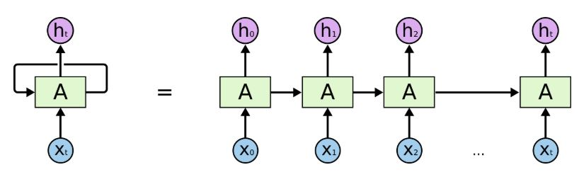

# Char-nn
A Recurrent Neural Network to generate text character-by-character

# Overview

This project is a Recurrent Neural Network trained to generate text character by character. In this project specifically I used a variation of an [LSTM](http://colah.github.io/posts/2015-08-Understanding-LSTMs/) (Long Short Term Memory) network which uses a GRU (Gated Recurrent Unit). LSTM networks are a special kind of RNN which can learn long-term depencies via four interacting nueral network layers. These layers consist of gates composed of a sigmoi neural net layer. The LSTM uses these gates to "remember" or "forget" certain information. As the model trains, it learns to keep certain information of the text persistent and to forget other information.

Below are some results from training the RNN on the Shakespear text dataset.

```
aand than not then the well
Have thee but with sir, whin the pooth with stang my prey
To dish dutter

Aat of three to a with dose,
Sir, in thee thy do more is waster whis.

ABAUS:
Now, in a geed of thee

hing bodrent to other,
Thou how kil, shall our senter from the die
How not the brother cound my from
```

# Methods
See [Char-nn.ipynb](Char-nn.ipynb)
